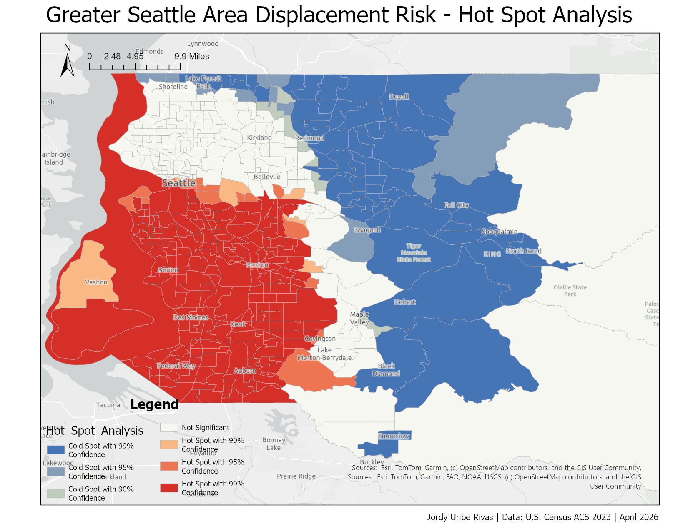
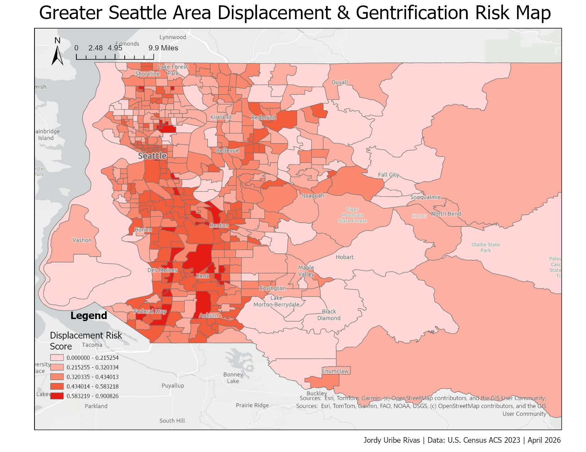

# Seattle Displacement & Gentrification Risk Map

A tract-level displacement risk index for King County, WA built using U.S. Census ACS data, 
GeoPandas, and ArcGIS Pro. Identifies communities most vulnerable to displacement using 
four socioeconomic indicators and statistically significant hot spot analysis.

## Live Maps
- [Displacement Risk Choropleth](https://arcg.is/qyreL0) — Weighted composite risk score by census tract
- [Hot Spot Analysis](https://arcg.is/1b1H4u0) — Statistically significant clusters of high and low displacement risk (Getis-Ord Gi*)

## Maps



## Methodology
The displacement risk score is a weighted composite of four normalized indicators:

| Indicator | Weight | Source |
|---|---|---|
| % Renters | 25% | Census ACS B25003 |
| % Cost-Burdened Renters | 25% | Census ACS B25070 |
| % People of Color | 25% | Census ACS B03002 |
| Median Income (inverted) | 25% | Census ACS B19013 |

Each indicator is normalized to a 0–1 scale using min-max normalization before 
the weighted sum is computed. Hot spot analysis uses the Getis-Ord Gi* statistic 
to identify statistically significant spatial clusters of high and low risk.

See [methodology/Seattle_Displacement_Risk_Methodology.pdf](methodology/Seattle_Displacement_Risk_Methodology.pdf) for full documentation.

## Data Sources
- U.S. Census Bureau ACS 5-Year Estimates (2023)
- Census TIGER/Line Shapefiles (2023)
- King County, WA (FIPS: 53033)

## Tech Stack
- **Python** — data acquisition and preparation (requests, pandas, geopandas)
- **ArcGIS Pro** — spatial analysis, hot spot analysis, map layout
- **ArcGIS Online** — hosted feature layer, Experience Builder app
- **GitHub** — version control, reproducible pipeline

## Project Structure

seattle-displacement-risk/
├── .env
├── .env.example
├── .gitignore
├── README.md
├── data/
├── scripts/
├── outputs/
└── Seattle-Displacement-Risk/

## Setup & Usage
```bash
# Clone the repo
git clone https://github.com/jordyuribe/seattle-displacement-risk.git
cd seattle-displacement-risk

# Create virtual environment
python -m venv .venv
.venv\Scripts\activate

# Install dependencies
pip install requests pandas geopandas python-dotenv

# Add your Census API key
cp .env.example .env
# Edit .env and add your key: API_KEY=your_key_here

# Run the full pipeline
python scripts/fetch_census.py
python scripts/normalize_indicators.py
python scripts/download_shapefile.py
python scripts/join_scores.py
```

Get a free Census API key at https://api.census.gov/data/key_signup.html

## Author
Jordy Uribe Rivas — [linkedin.com/in/jordyuribe](https://linkedin.com/in/jordyuribe)  
B.A. Geography: Data Science, University of Washington